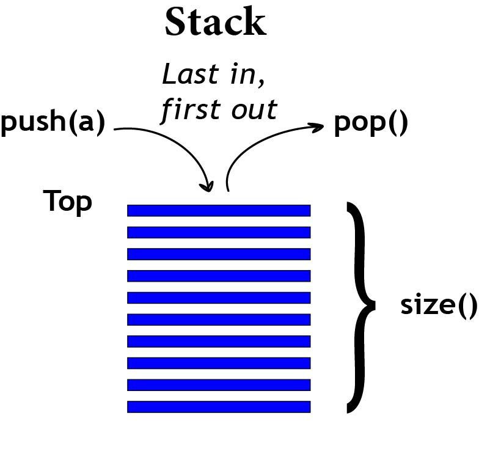

# Stack

## Introduction to Stack Data Structure

A stack is a data structure that follows the Last-In, First-Out (LIFO) principle. It allows you to add and remove elements from one end called the top. While this type of data structure is not very flexible, it is very efficient for certain types of operations. Common use cases for stacks include managing function calls, undo/redo operations, and expression evaluation.

A common way to think of a stack is to imagine a stack of books. You can add a new book to the top of the stack or remove a book from the top of the stack. You can't add or remove a book from the middle of the stack. The last book you add to the stack is the first book you can remove from the stack.

<picture style="width: 100%; display: flex; justify-content: center;">
    
</picture>
<label><strong>Stack diagram</strong></label>
<br /><br />

## Implementation of Stack in Python

In Python, you can implement a stack using a list or a built-in module called `deque` from the `collections` module. Here's an example of a stack implementation using a list:

```python
class Stack:
    def __init__(self):
        self.stack = []

    def push(self, item):
        self.stack.append(item)

    def pop(self):
        if not self.is_empty():
            return self.stack.pop()
        else:
            raise Exception("Stack is empty")

    def size(self):
        return len(self.stack)

    def is_empty(self):
        return self.size() == 0
```

The push method adds an item to the top of the stack, the pop method removes and returns the top item, the size method returns the number of items in the stack, and the is_empty method checks if the stack is empty. All of these operations have a time complexity of O(1).

## Example: Checking Balanced Parentheses

Let's consider an example problem of checking balanced parentheses in an expression using a stack. The problem is to determine if the parentheses in the given expression are balanced or not. Here's the step-by-step solution using stack operations:

1. Initialize an empty stack.
2. Iterate through each character in the expression.
   - If the character is an opening parentheses (e.g., '(' or '{' or '['), push it onto the stack.
   - If the character is a closing parentheses (e.g., ')' or '}' or ']'), check if the stack is empty. If it is, return False since the expression is unbalanced. Otherwise, pop the top element from the stack and compare it with the closing parentheses. If they don't match, return False.
3. After iterating through all characters, check if the stack is empty. If it is, return True; otherwise, return False.

Here's the Python code that solves this problem using a stack:

```python
def is_balanced(expression):
    stack = Stack()

    for char in expression:
        if char in "([{":
            stack.push(char)
        elif char in ")]}":
            if stack.is_empty():
                return False
            top = stack.pop()
            if (top == "(" and char != ")") or (top == "[" and char != "]")
            or (top == "{" and char != "}"):
                return False

    return stack.is_empty()

# Test the function
expression = "((2 + 3) * [5 - 4])"
if is_balanced(expression):
    print("The expression is balanced.")
else:
    print("The expression is not balanced.")
```

## Problem: Reversing a String

For this problem, let's consider the task of reversing a string using a stack. You need to write a program that takes a string as input, uses a stack to reverse the string, and prints the reversed string as output. Here's an example of the expected behavior:

```python
string = "Hello, world!"
# Expected output: "!dlrow ,olleH"
```

You can try to solve this problem on your own. Once you have a solution or if you need help, you can find the solution here: [Solution](./python%20files/stack-solution.py)

That concludes the tutorial on the Stack data structure. You have learned about the characteristics of a stack, its implementation in Python, and how to solve a problem using a stack. In the next module, you will learn about another type of data structure called a linked list.

[Return to Welcome Page](./0-welcome.md)
<strong>OR</strong>
[Continue to Next Module: Linked Lists](./2-linked-list.md)
