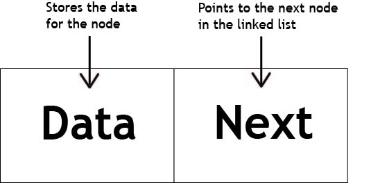
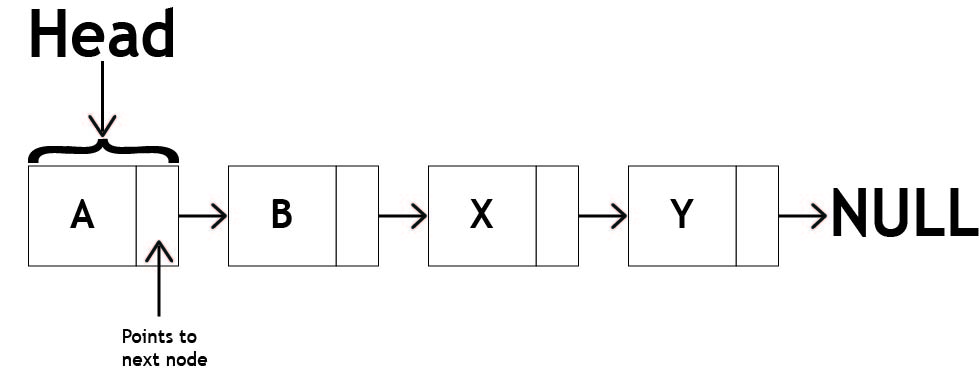
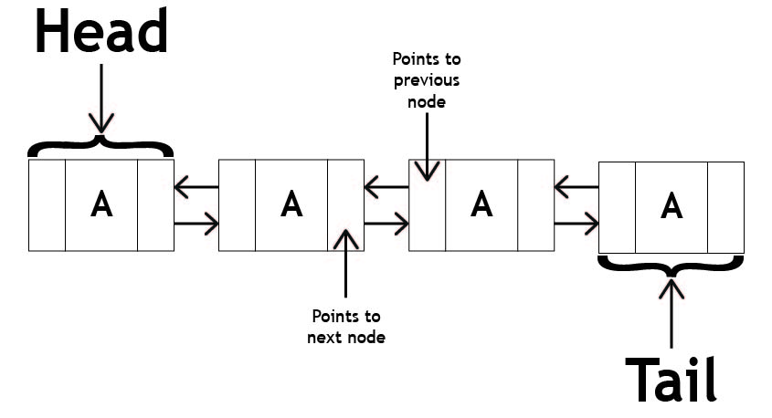

# Linked Lists

## Introduction to Linked List Data Structure

A linked list is a data structure that consists of a sequence of nodes, where each node contains data and a reference to the next node in the sequence.

<picture style="width: 100%; display: flex; justify-content: center;">
    
</picture>
<label><strong>Linked List Node</strong></label>
<br /><br />

Unlike arrays, linked lists do not have a fixed size and allow efficient insertion and removal of elements at any position. Linked lists can be implemented as singly linked lists, where each node only has a reference to the next node, or as doubly linked lists, where each node has references to both the next and previous nodes.

<picture style="width: 100%; display: flex; justify-content: center;">
    
</picture>
<label><strong>Singly Linked List</strong></label>
<hr />
<picture style="width: 100%; display: flex; justify-content: center;">
    
</picture>
<label><strong>Doubly Linked List</strong></label>
<br /><br />

As you can see, the nodes are a little different in a doubly linked list. Instead of having only a next reference, each node has a next and previous reference. This allows you to traverse the list in both directions. This is also known as a bidirectional linked list.

## Implementation of Linked List in Python

In Python, you can implement a linked list using a Node class and a LinkedList class. Here's an example implementation of a singly linked list:

```python
class Node:
    def __init__(self, data):
        self.data = data
        self.next = None

class LinkedList:
    def __init__(self):
        self.head = None

    def insert_head(self, data):
        new_node = Node(data)
        new_node.next = self.head
        self.head = new_node

    def insert_tail(self, data):
        new_node = Node(data)
        if self.head is None:
            self.head = new_node
        else:
            current = self.head
            while current.next:
                current = current.next
            current.next = new_node

    def insert(self, data, position):
        if position == 0:
            self.insert_head(data)
        else:
            new_node = Node(data)
            current = self.head
            for _ in range(position - 1):
                if current.next is None:
                    raise IndexError("Position out of range")
                current = current.next
            new_node.next = current.next
            current.next = new_node

    def remove_head(self):
        if self.head is None:
            raise Exception("LinkedList is empty")
        removed = self.head
        self.head = self.head.next
        removed.next = None
        return removed.data

    def remove_tail(self):
        if self.head is None:
            raise Exception("LinkedList is empty")
        if self.head.next is None:
            removed = self.head
            self.head = None
        else:
            current = self.head
            while current.next.next:
                current = current.next
            removed = current.next
            current.next = None
        return removed.data

    def remove(self, position):
        if position == 0:
            return self.remove_head()
        else:
            current = self.head
            for _ in range(position - 1):
                if current.next is None:
                    raise IndexError("Position out of range")
                current = current.next
            removed = current.next
            if removed is None:
                raise IndexError("Position out of range")
            current.next = removed.next
            removed.next = None
            return removed.data

    def size(self):
        count = 0
        current = self.head
        while current:
            count += 1
            current = current.next
        return count

    def is_empty(self):
        return self.head is None
```

The `LinkedList` class has methods to insert a node at the head or tail, insert a node at a specific position, remove the head or tail node, remove a node at a specific position, get the size of the linked list, and check if the linked list is empty. These operations have different time complexities, with insertion and removal at the head or tail taking constant time O(1) and insertion and removal at a specific position taking linear time O(n), where n is the size of the linked list. This is because you need to traverse the linked list to find the node at the specified position before adjusting the references. The size and empty methods also take constant time O(1) because you only need to return the size of the linked list or check if the length is zero.

## Example: Implementing a Queue with a Linked List

Let's consider an example problem of implementing a queue using a linked list. A queue follows the First-In, First-Out (FIFO) principle, where elements are added at the rear and removed from the front. Here's a step-by-step solution using linked list operations:

1. Initialize an empty linked list to represent the queue.
2. To enqueue an element, insert it at the tail of the linked list.
3. To dequeue an element, remove it from the head of the linked list.
4. To get the size of the queue, use the size method of the linked list.
5. To check if the queue is empty, use the is_empty method of the linked list.

Here's the Python code that implements a queue using a linked list, assuming that the linked list class has the methods described above:

```python
class Queue:
    def __init__(self):
        self.linked_list = LinkedList()

    def enqueue(self, item):
        self.linked_list.insert_tail(item)

    def dequeue(self):
        return self.linked_list.remove_head()

    def size(self):
        return self.linked_list.size()

    def is_empty(self):
        return self.linked_list.is_empty()

```

## Problem: Finding the Middle Element

For this problem, let's consider the task of finding the middle element of a linked list. You need to write a program that takes a linked list as input, finds and returns the middle element of the list. If the list has an even number of elements, you should return the second middle element. Here's an example of the expected behavior:

```python
linked_list = LinkedList()
linked_list.insert_tail(1)
linked_list.insert_tail(2)
linked_list.insert_tail(3)
linked_list.insert_tail(4)
linked_list.insert_tail(5)
# Expected output: 3

linked_list.insert_tail(6)
# Expected output: 4
```

You should try to solve this problem on your own. Once you have a solution or if you need help, you can find the solution here: [Solution](./python%20files/linked-list-solution.py)

Remember to use linked list operations (insert_head, insert_tail, insert, remove_head, remove_tail, remove, is_empty, size) to solve the problem.

That concludes the tutorial on the Linked List data structure. You have learned about the characteristics of a linked list, its implementation in Python, and how to solve a problem using a linked list. In the next module, you will learn about the Tree data structure.

[Return to Welcome Page](./0-welcome.md)
<strong>OR</strong>
[Continue to Next Module: Trees](./3-tree.md)
