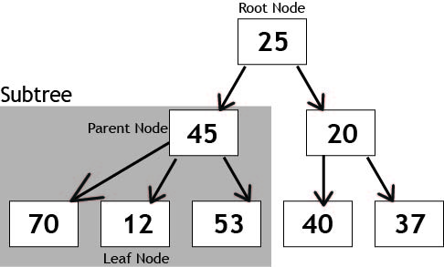
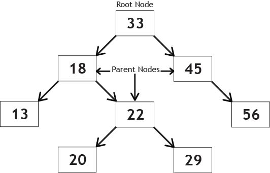

# Trees

## Introduction to Tree Data Structure

A tree is a hierarchical data structure that consists of nodes connected by edges. It is composed of a collection of nodes, where each node contains data and can have zero or more child nodes. Trees have a hierarchical structure with a root node at the top and leaf nodes at the bottom. They are used to represent hierarchical relationships, such as file systems, organization structures, family trees, and more.

<picture style="width: 100%; display: flex; justify-content: center;">
    
</picture>
<label><strong>Tree Diagram</strong></label>
<br /><br />

### Binary Search Trees (BST)

A binary search tree (BST) is a type of tree where each node has at most two children. In a BST, the values in the left subtree of a node are less than the value of the node, while the values in the right subtree are greater than the node's value. This ordering property enables efficient search, insertion, and deletion operations.

Binary search trees are commonly used in scenarios where elements need to be maintained in a sorted order. They provide an efficient way to perform operations such as finding the minimum or maximum value, searching for a specific element, or performing range queries.

Here's an example of a binary search tree (BST) that is fully sorted:

<picture style="width: 100%; display: flex; justify-content: center;">
    
</picture>
<label><strong>Sorted Binary Search Tree Diagram</strong></label>
<br /><br />

## Implementation of Tree in Python

In Python, you can implement a tree using a Node class and a Tree class. Each node contains data and references to its children nodes. Here's an example implementation of a tree:

```python
class Node:
    def __init__(self, data):
        self.data = data
        self.children = []

class Tree:
    def __init__(self):
        self.root = None

    def insert(self, data, parent_data=None):
        new_node = Node(data)
        if parent_data is None:
            if self.root is not None:
                raise Exception("Tree already has a root")
            self.root = new_node
        else:
            parent_node = self.find(parent_data)
            if parent_node is None:
                raise Exception("Parent node not found")
            parent_node.children.append(new_node)

    def find(self, data):
        if self.root is None:
            return None
        queue = [self.root]
        while queue:
            current = queue.pop(0)
            if current.data == data:
                return current
            queue.extend(current.children)
        return None

    def remove(self, data):
        if self.root is None:
            raise Exception("Tree is empty")
        if self.root.data == data:
            self.root = None
        else:
            queue = [self.root]
            while queue:
                current = queue.pop(0)
                for child in current.children:
                    if child.data == data:
                        current.children.remove(child)
                        return
                    queue.append(child)

    def contains(self, data):
        if self.root is None:
            return False
        queue = [self.root]
        while queue:
            current = queue.pop(0)
            if current.data == data:
                return True
            queue.extend(current.children)
        return False

    def traverse_forward(self):
        if self.root is None:
            return []
        result = []
        stack = [self.root]
        while stack:
            current = stack.pop()
            result.append(current.data)
            stack.extend(reversed(current.children))
        return result

    def traverse_reverse(self):
        if self.root is None:
            return []
        result = []
        stack = [self.root]
        while stack:
            current = stack.pop()
            result.append(current.data)
            stack.extend(current.children)
        return result

    def size(self):
        if self.root is None:
            return 0
        count = 0
        queue = [self.root]
        while queue:
            current = queue.pop(0)
            count += 1
            queue.extend(current.children)
        return count

    def is_empty(self):
        return self.root is None
```

The Tree class has methods to insert a node, remove a node, check if a node exists, traverse the tree in a forward or reverse manner, get the size of the tree, and check if the tree is empty. These operations have different time complexities depending on the tree structure and size. Insert, remove, and contains operations have a time complexity of O(log n) for a balanced tree and O(n) for an unbalanced tree. The traverse_forward and traverse_reverse operations have a time complexity of O(n). The size and is_empty operations have a time complexity of O(1).

However, more often than not, you'll want to use a BST. The code to implement a BST is a little different:

```python
class Node:
    def __init__(self, data):
        self.data = data
        self.left = None
        self.right = None


class BST:
    def __init__(self):
        self.root = None

    def insert(self, data):
        if self.root is None:
            self.root = Node(data)
        else:
            self._insert(data, self.root)

    def _insert(self, data, current_node):
        if data < current_node.data:
            if current_node.left is None:
                current_node.left = Node(data)
            else:
                self._insert(data, current_node.left)
        elif data > current_node.data:
            if current_node.right is None:
                current_node.right = Node(data)
            else:
                self._insert(data, current_node.right)
        else:
            print("Value already in tree.")

    def find(self, data):
        if self.root:
            is_found = self._find(data, self.root)
            if is_found:
                return True
            return False
        else:
            return None

    def _find(self, data, current_node):
        if data > current_node.data and current_node.right:
            return self._find(data, current_node.right)
        elif data < current_node.data and current_node.left:
            return self._find(data, current_node.left)
        if data == current_node.data:
            return True

    def remove(self, data):
        if self.root:
            self.root = self._remove(data, self.root)

    def _remove(self, data, current_node):
        if not current_node:
            return current_node
        elif data < current_node.data:
            current_node.left = self._remove(data, current_node.left)
        elif data > current_node.data:
            current_node.right = self._remove(data, current_node.right)
        else:
            # removing node with no or single child
            if not current_node.right:
                return current_node.left
            if not current_node.left:
                return current_node.right

            # removing node with two children
            temp_val = self._find_min(current_node.right)
            current_node.data = temp_val
            current_node.right = self._remove(temp_val, current_node.right)
        return current_node

    def _find_min(self, current_node):
        if current_node.left:
            return self._find_min(current_node.left)
        return current_node.data

    def inorder_print_tree(self):
        if self.root:
            self._inorder_print_tree(self.root)

    def _inorder_print_tree(self, current_node):
        if current_node:
            self._inorder_print_tree(current_node.left)
            print(str(current_node.data))
            self._inorder_print_tree(current_node.right)

    def preorder_print_tree(self):
        if self.root:
            self._preorder_print_tree(self.root)

    def _preorder_print_tree(self, current_node):
        if current_node:
            print(str(current_node.data))
            self._preorder_print_tree(current_node.left)
            self._preorder_print_tree(current_node.right)

    def postorder_print_tree(self):
        if self.root:
            self._postorder_print_tree(self.root)

    def _postorder_print_tree(self, current_node):
        if current_node:
            self._postorder_print_tree(current_node.left)
            self._postorder_print_tree(current_node.right)
            print(str(current_node.data))

    def height(self):
        if self.root:
            return self._height(self.root)
        else:
            return 0

    def _height(self, current_node):
        if current_node is None:
            return -1
        left_height = self._height(current_node.left)
        right_height = self._height(current_node.right)
        return 1 + max(left_height, right_height)

    def size(self, node):
        if node is None:
            return 0
        else:
            return 1 + self.size(node.left) + self.size(node.right)

    def is_empty(self):
        return not bool(self.root)
```

In this code:

- The remove method deletes a node from the BST.
- The inorder_print_tree method is equivalent to traversing forward (ascending order).
- The postorder_print_tree method is equivalent to traversing in reverse (descending - order).
- The size method returns the total number of nodes in the BST.
- The is_empty method checks if the BST is empty.
- The height method returns the height of the BST and has a time complexity of O(n).

## Example: Binary Search Tree Operations

Let's consider an example of creating and manipulating a Binary Search Tree (BST). Here are the steps to create a BST and perform various operations:

1. Initialize an empty BST.
2. For each value that you want to add to the BST, use the insert method.
3. Use the inorder_print_tree method to print the values in the BST in ascending order.

Here's the Python code that demonstrates these steps using a BST:

```python
bst = BST()
bst.insert(5)  # Root
bst.insert(3)  # Left child of root
bst.insert(7)  # Right child of root
bst.insert(2)  # Left child of 3
bst.insert(4)  # Right child of 3
bst.insert(6)  # Left child of 7
bst.insert(8)  # Right child of 7

# Print the elements in the tree in ascending order
bst.inorder_print_tree()
# Expected Output: 2 3 4 5 6 7 8

```

## Problem: Counting Leaf Nodes

For this problem, let's consider the task of counting the number of leaf nodes in a tree. A leaf node is a node that does not have any children.

You need to write a program that takes a tree as input and returns the count of leaf nodes in the tree.

Here's an example of the expected behavior:

```python
bst = BST()
bst.insert(5)
bst.insert(3)
bst.insert(7)
bst.insert(2)
bst.insert(4)
bst.insert(6)
bst.insert(8)

print(bst.count_leaves())
# Expected output: 4
```

You can try to solve this problem on your own. Once you have a solution or if you need help, you can find the solution here: [Solution](./python%20files/tree-solution.py)

Remember to use tree operations (contains) to solve the problem.

That concludes the tutorial on the Tree data structure. You have learned about the characteristics of a tree, its implementation in Python, and how to solve a problem using a tree. This was the final module and concludes the tutorial. Congratulations on completing the tutorial!

[Return to Welcome Page](./0-welcome.md)
